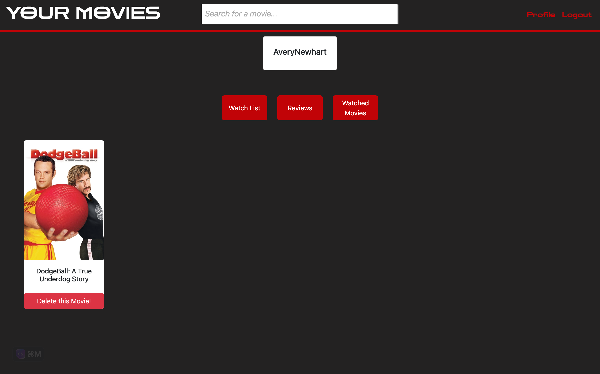
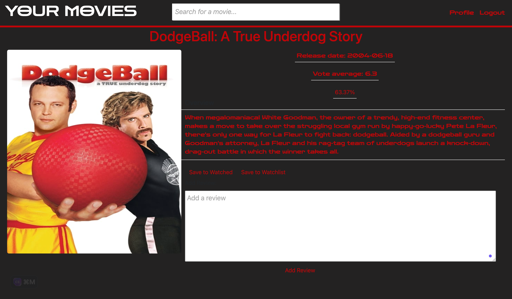

# YOUR-MOVIES

- Are you a movie buff looking for an exciting new way to keep track of your favorite films? Look no further than YOUR MOVIES, the ultimate movie website! And the best part? By creating an account, you can quickly search for any movie you want and add it to your watched or watchlist. Plus, there is the option to write reviews on the movies you've seen. Say goodbye to disorganized movie lists and hello to YOUR MOVIES!


# Badges

[](https://choosealicense.com/licenses/mit/)

# Table Of Contents

- [Authors](#Authors)

- [installation](#installation)

- [Usage](#Usage)

- [License](#License)

- [Questions](#Questions)

# Authors

- [ Avery](https://github.com/AveryNewhart)

- [ Paul](https://github.com/Pauldan1988)

# Installation

### installation

```bash
  npm i
```

### Getting started
If you just need to lok into the backend, you can utilize the nodemon server, but in order to load the full react application you must run npm run develop in the root directory of the project.
```scripts
    nodemon server
    npm run develop
```

You can use npm run seed, or npm start 

# Usage

- https://yourmovies.herokuapp.com/






## Questions

Have any questions? Feel free to reach any of our contributors via LinkdIn

### Avery
- [ linkedin](https://www.linkedin.com/in/avery-newhart-0654a9263/)
- [Portfolio](www.averynewhart.com)
- [email](newhartreeceavery@gmail.com)

### Paul
- [linkedin](https://www.linkedin.com/in/paul-d-angelo-jr-431407257/)
- [email](pdangelo1988@gmail.com)